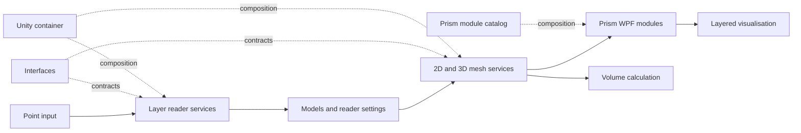

# Architecture

## Purpose

OilUtils models a body bounded by depth surfaces. It reads points, constructs two-dimensional or three-dimensional mesh data, renders the result through WPF controls, and can calculate an enclosed volume.

## Component view

## Modules and responsibilities

| Area | Responsibility |
|---|---|
| `Models` | Layer data, reader settings, unit enums, and unit-factor metadata. |
| `Interfaces` | Contracts for point readers, mesh operations, and unit conversion. |
| `Services` | Reads point data, creates mesh positions/triangles, calculates volume, and registers implementations with Unity. |
| `LayeringControlLibrary` | Prism view models and views that compose the layered desktop interface. |
| `Infrastructure` | Shared MVVM commands, base view model, extensions, and region names. |
| `Services.Tests` | NUnit tests for readers, unit conversion, two-dimensional mesh behavior, and three-dimensional mesh/volume behavior. |
| `OilUtils` | WPF host application and Prism module configuration. |

`ServicesModule` registers the reader, mesh, and unit-conversion implementations. `LayeringControlsModule` registers the view models and maps views to Prism regions. The host loads both modules from `OilUtils/App.config`.

## Geometry flow

The three-dimensional mesh service accepts:

- `Xs` and `Ys`: a rectangular grid.
- `Z1s` and `Z2s`: same-sized arrays representing the two bounding surfaces.

It flattens the grid into paired upper/lower vertices, produces triangles for the top, bottom, and side faces, then sums the signed tetrahedral contributions to obtain a volume. The implementation caches calculated positions, triangle indices, and volume until `Reset()` is called.

The tests use cube-shaped inputs to validate the core invariants: valid surface dimensions, expected vertices, expected triangle indices, and volumes of 1, 2, and 8 units.

## Design trade-offs visible in the code

- Interfaces separate rendering-oriented contracts from calculation and input concerns.
- Prism modules allow the host to compose services and views at runtime.
- Stateful mesh services cache calculations, reducing repeat work but making object lifecycle and input mutation important.
- Mesh positions are represented as formatted strings for the UI path rather than as typed vertex values at the rendering boundary.
